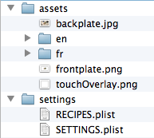

video-table-interactive
=======================

A video table interactive in Cinder and C++.

The application consists of four user areas that play videos by receiving keypresses or analog sensor signals from the a Phidgets 8/8/8 InterfaceKit.

Sensor data uses the Phidgets-CinderBlock: https://github.com/camb416/Phidgets-CinderBlock

While more buttons can be added by modifying the plist settings files, the default keymapping is below:

<pre>
TOP-LEFT USER AREA
Q............Back / Switch Language
W............Select Button
E............Skip Button

TOP-RIGHT USER AREA
R............Back / Switch Language
T............Select Button
Y............Skip Button

BOTTOM-LEFT USER AREA
A............Back / Switch Language
S............Select Button
D............Skip Button

BOTTOM-RIGHT USER AREA
F............Back / Switch Language
G............Select Button
H............Skip Button

APPLICATION FUNCTIONS:
~............Toggle Fullscreen
SPACE........Cycle Debug States
</pre>

